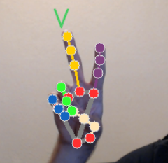

# Hand Sign Recognition for American Sign Language Alphabet

## Overview

This project focuses on making a Hand sign translator for the American Sign Language to be eventually be deployed in the Google play store. 

The project was created to build my personal portfolio while also filling what seems to be a gap in the Google play store. I wanted a better understanding of machine learning, app development, and Programming languages like Python and Java. 

## Features

Live translation of hand signs using the American Sign Language Alphabet.

## To Do:

- Alter python script to only take a specific image resolution
- Jupyter Notebook
- App development
- Deployment

## Running this project

To replicate the entire process of creating Hand Sign Recognition, please take a look at the jupyter notebook file titled 'hand_sign.ipynb' explaining the process.

## Dev Dependencies

Extremely grateful to the following technologies that have allowed for this project to happen:

- [Google Hand Landmark Detection](https://ai.google.dev/edge/mediapipe/solutions/vision/hand_landmarker)
- [OpenCV](https://opencv.org/)
- [Scikit Learn](https://scikit-learn.org/stable/)
- Python
